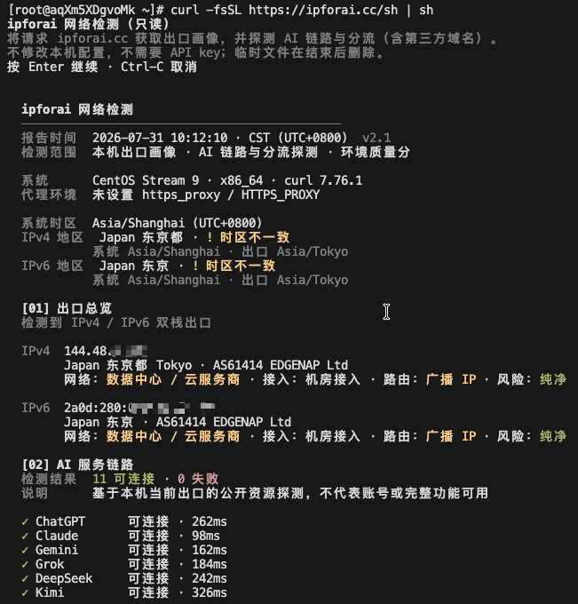
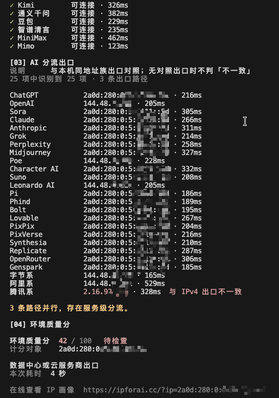

# ipforai Network Check

[中文](./README.md) · [Website](https://ipforai.cc) · [Method](https://ipforai.cc/about)

Network environment checks for **AI access**: public exit profile, network / access / routing attributes, risk signals, environment score, and availability references for ChatGPT, Claude, Gemini, and more (**Available / Limited / Unavailable / Pending**).

Results describe the **network only**. They are not account login, subscription, or platform risk decisions.

---

## One-liners

### Terminal

Quick execution (`sh` or `bash`):
```bash
curl -fsSL https://ipforai.cc/sh | sh
curl -fsSL https://ipforai.cc/sh | bash
```

Review before run (recommended):

```bash
curl -fsSL https://ipforai.cc/sh -o /tmp/ipforai-check.sh
less /tmp/ipforai-check.sh
sh /tmp/ipforai-check.sh -y
# Or use bash: bash /tmp/ipforai-check.sh -y
```

```bash
curl -fsSL https://ipforai.cc/sh | sh -s -- -y
curl -fsSL https://ipforai.cc/sh | sh -s -- -y 8.8.8.8
curl -fsSL https://ipforai.cc/sh | sh -s -- -y -d
```

The `sh` in these examples can be replaced with `bash`; both run the same POSIX-compatible script.

> **Canonical script URL is always** `https://ipforai.cc/sh`. `check.sh` in this repo is a review mirror; use the website version as the source of truth.

### Example output

These are redacted dual-stack terminal examples. IPs, time zones, latencies, and service results vary with the actual network environment.





### Developer JSON (GET)

```bash
# GET /json: profile the request source IP observed by the server
curl -fsSL 'https://ipforai.cc/json'

# GET /json?ip=: server-side lookup for a specified IPv4 or IPv6
curl -fsSL 'https://ipforai.cc/json?ip=8.8.8.8'
curl -fsSL 'https://ipforai.cc/json?ip=2001:4860:4860::8888'

# Force the request over IPv4 or IPv6
curl -4 -fsSL 'https://ipforai.cc/json'
curl -6 -fsSL 'https://ipforai.cc/json'

# Encode ip as a GET parameter
curl --get -fsSL --data-urlencode 'ip=8.8.8.8' 'https://ipforai.cc/json'
```

`ip` is the only optional query parameter. Omit it or leave it empty to profile the request source IP; provide an address for a server-side profile lookup. It does not initiate a live connection from that address or inspect the caller's local system or browser. An invalid address returns HTTP 400.

See [docs/api.md](./docs/api.md) ([中文](./docs/api.zh.md)) and [examples/sample.json](./examples/sample.json).

One HTTP request fills only one of `ipv4` / `ipv6` (`dualStack` is usually `false`).

---

## Scope

| Included | Notes |
|----------|--------|
| Exit profile | Geo, ASN, network type, access form, routing |
| Risk signals | Proxy-related level, Tor exit when data exists |
| Environment score | Network reference score — **not** an account score |
| AI labels | Same as the site: Available / Limited / Unavailable / Pending |
| CLI path probes | From **this machine’s exit** only (not for arbitrary `?ip=` as live path) |

**Not included:** ban prediction, unlock guarantees, “IP purity” marketing scores.

---

## Runtime boundary

- **CLI:** POSIX `sh`, `curl`, and standard system utilities; it does not install packages or write system configuration.
- **Network requests:** the CLI probes `ipforai.cc`, the IPv4 probe host, and the public AI/vendor endpoints listed in the script. The JSON API requests the website backend profile service.
- **Mirror:** `check.sh` is provided for review; the website endpoint is the canonical runtime source.

## Dual stack

One TCP connection exposes one source family. Use `curl -4` / `curl -6`, or `?ip=` for a specific address. The JSON shape always has `ipv4` / `ipv6` slots; the unused side is `null`.

## License

[MIT](./LICENSE)
