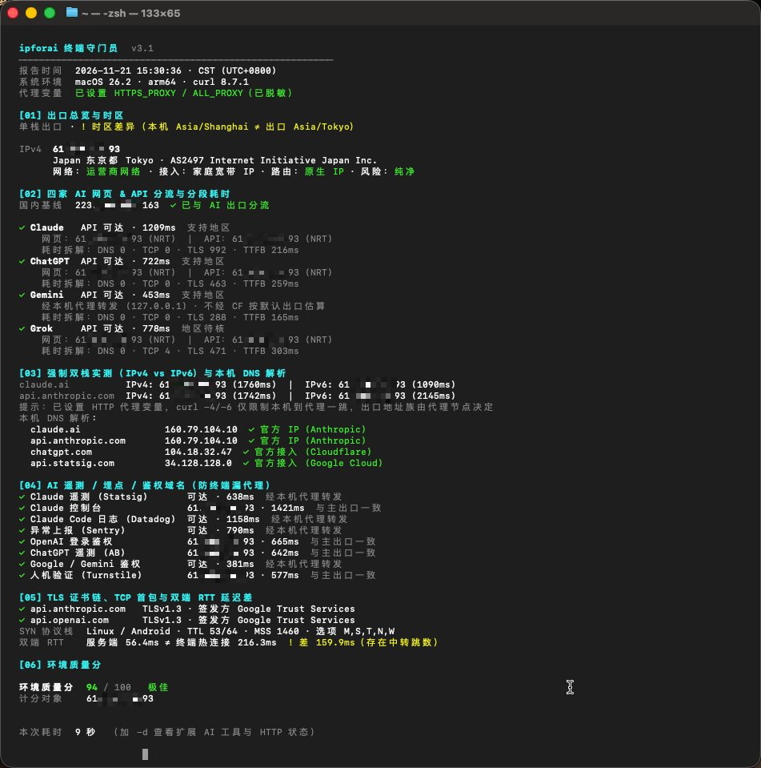

# IP for AI — Is It My Network, or Is It AI?

[中文](./README.md) · [Open Site](https://ipforai.cc) · [IP Purity](https://ipforai.cc/ip) · [AI Weather](https://ipforai.cc/weather) · [Regions](https://ipforai.cc/regions) · [Routing Checker](https://ipforai.cc/rules) · [ASN Database](https://ipforai.cc/datacenters) · [CLI](https://ipforai.cc/cli) · [Contact](https://ipforai.cc/contact)

Instantly see the exit IP, region, official status, and low-level leaks (WebRTC, DNS/ECS, TCP SYN/MSS, passive JA4, HTTP/3 QUIC) observed by **Claude, ChatGPT, Gemini, and Grok** — with every issue labeled as fixable locally, fixable via routing rules, or requiring a different node.

> Evaluates the network environment only — never predicts account bans or subscription eligibility.


---

## Pages & Tools

- **Dashboard**: [ipforai.cc](https://ipforai.cc) — Side-by-side exits, scores, and interactive fix simulation
- **IP Purity Check**: [ipforai.cc/ip](https://ipforai.cc/ip) — 0–100 purity score (A+ to F), native vs. broadcast IP & ASN cross-region routing detection, dual-ISP vs. leased hosting subnet breakdown (IRR + on-demand RDAP), IP2Proxy, Spamhaus, public threat feeds, and 10 DNSBL zones
- **Leak Diagnostics**: [WebRTC Leak](https://ipforai.cc/webrtc-leak) · [DNS Leak](https://ipforai.cc/dns-leak) — Concurrent STUN candidates and recursive DNS / ECS subnet checks
- **Per-Service Checks**: [Claude](https://ipforai.cc/claude-check) · [ChatGPT](https://ipforai.cc/chatgpt-check) · [Gemini](https://ipforai.cc/gemini-check) · [Grok](https://ipforai.cc/grok-check)
- **AI Weather**: [ipforai.cc/weather](https://ipforai.cc/weather) — Live official status, affected components & active incidents, 60-day incident history, and 7-region API reachability
- **AI Supported Regions**: [ipforai.cc/regions](https://ipforai.cc/regions) — Official Web / App / API eligibility across 10 major node regions
- **Routing Checker & Rulesets**: [ipforai.cc/rules](https://ipforai.cc/rules) — Hosted Clash / Mihomo, Surge, Sing-box, and Quantumult X rulesets plus client-side checks for 89 core, coding-tool, extended AI, auth, and telemetry domains
- **ASN & Datacenter DB**: [ipforai.cc/datacenters](https://ipforai.cc/datacenters) — 120k+ global ASNs with PeeringDB metadata and per-ASN deep pages (`/asn/as<num>`) with IRR leased-hosting breakdowns

---

## Terminal Check (CLI)

On a local computer, terminals ignore the OS system proxy by default. Either enable **TUN mode**, or run in a subshell with your proxy port so both `curl` and `sh` route through it:

```bash
# VPS / server, or local terminal with TUN mode enabled
curl -fsSL https://ipforai.cc/sh | sh

# Local terminal without TUN (replace 7890 with your proxy port)
(export HTTPS_PROXY=http://127.0.0.1:7890 ALL_PROXY=socks5h://127.0.0.1:7890;
  curl -fsSL https://ipforai.cc/sh | sh)

# Profile a specific IP only
curl -fsSL https://ipforai.cc/sh | sh -s -- 8.8.8.8

# Non-interactive + detailed diagnostics
curl -fsSL https://ipforai.cc/sh | sh -s -- -y -d

# Force the IPv4 (-4) or IPv6 (-6) egress and connectivity path only
curl -fsSL https://ipforai.cc/sh | sh -s -- -4

# One-screen summary (exits, AI reachability, base score)
curl -fsSL https://ipforai.cc/sh | sh -s -- -s

# Output forum-ready Markdown table (with 7-day masked share link)
curl -fsSL https://ipforai.cc/sh | sh -s -- -m

# Disable masked online share link creation
curl -fsSL https://ipforai.cc/sh | sh -s -- --no-share

# Output JSON to stdout (implies -y, for scripting)
curl -fsSL https://ipforai.cc/sh | sh -s -- -j
```



> Canonical URL: `https://ipforai.cc/sh`. [`check.sh`](./check.sh) is a review mirror (`v3.8`).

---

## JSON API, Badge & MCP

```bash
curl -fsSL 'https://ipforai.cc/json'
curl -fsSL 'https://ipforai.cc/json?ip=8.8.8.8'
```

```bash
claude mcp add ipforai -- npx -y ipforai-mcp
```

4 tools: `check_my_ip`, `lookup_ip`, `check_ai_weather`, and `lookup_asn`. Docs: [docs/api.md](./docs/api.md) · [docs/badge.md](./docs/badge.md) · [mcp/README.md](./mcp/README.md)

---

## Business & Contact

For sponsorships, partnerships, API integration, or data corrections, email [bd@ipforai.cc](mailto:bd@ipforai.cc) or visit [ipforai.cc/contact](https://ipforai.cc/contact).

---

## License

[MIT](./LICENSE)
